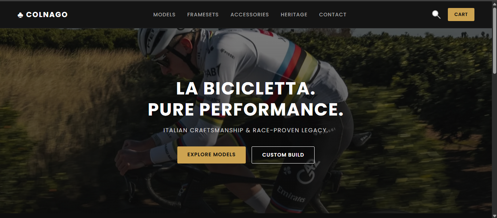
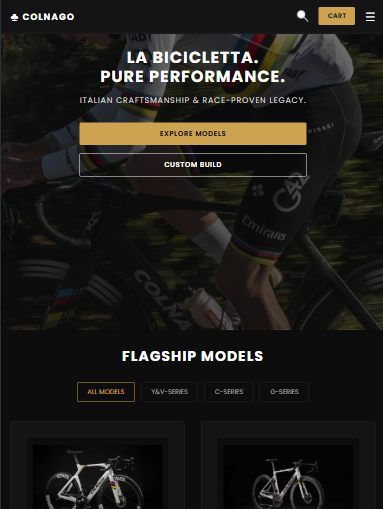
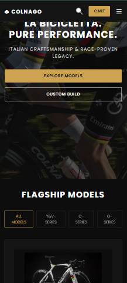

# Colnago Store 🚴‍♂️

A sleek, responsive showcase website for luxury Italian cycling brand **Colnago**. Built using modern HTML5, CSS3, and JavaScript, this project features a high-end luxury dark aesthetic, interactive product filtering, dynamic navigation, and seamless cross-device responsiveness.

---

## 📌 Project Overview

The **Colnago Store** website serves as a modern digital storefront showcasing flagship bicycle models across different series (Y&V-Series, C-Series, and G-Series). The design reflects Italian craftsmanship, race-proven performance, and brand prestige with a gold-and-dark aesthetic.

### Key Features
- **Responsive Layout:** Optimized layout across Desktop, Tablet, and Mobile screens.
- **Dynamic Category Filtering:** Filter flagship bike models instantly without page reloads.
- **Interactive Navigation:** Mobile menu toggle drawer for compact screens.
- **Hero Banner:** Full-screen background layout showcasing race action with call-to-action buttons.

---

## 📱 Responsiveness & Screenshots

*(Replace the placeholder URLs below with your actual screenshot images)*

### Desktop View
Designed for large screens with full horizontal navigation links and multi-column grid layouts.



---

### Tablet View (`769px - 1024px`)
Adjusted margins, compact typography, and responsive grid layouts for tablet devices.



---

### Mobile View (`<= 768px`)
Includes a slide-down mobile navigation drawer toggled via a hamburger menu icon, single-column button layouts, and stacked hero actions.



---

## 🛠 Tech Stack & Implementation Details

### 1. HTML5 (`index.html`)
HTML provides the semantic structure for the entire website:
- **Semantic Tags:** Uses `<header>`, `<main>`, `<section>`, `<nav>`, `<button>`, and `<main>` for clean accessibility and SEO structure.
- **Data Attributes (`data-category`):** Embedded custom attributes on both the filter buttons (`data-category="v-series"`, `c-series`, etc.) and the product cards (`card`) to enable DOM-based filtering.
- **External Resources:** Links to Google Fonts (`Poppins`) and modern CSS stylesheet.

### 2. CSS3 (`style.css`)
CSS handles layout design, luxury branding, color schemes, and responsive design:
- **Flexbox & Grid:** Used Flexbox for navigation headers, button groups, and card contents; CSS Grid (`grid-template-columns: repeat(auto-fit, minmax(280px, 1fr))`) for fluid dynamic product cards.
- **Custom Aesthetic:** Dark themed background (`#0d0d0d`, `#141414`) with metallic gold accent highlights (`#cda351`).
- **Media Queries:** 
  - `@media (max-width: 1024px)` for tablet adaptations.
  - `@media (max-width: 768px)` for mobile hamburger navbar drawer transformation and vertical stacked hero elements.
- **Transitions & Hover States:** Smooth hover color shifts on primary and secondary buttons, borders, and navbar links (`transition: all 0.2s ease`).

### 3. JavaScript / DOM Manipulation (`script.js`)
JavaScript handles all real-time client-side interactions by manipulating the Document Object Model (DOM):
- **Hamburger Menu Toggle:**
  - Selects `#menuBtn` and `#navLinks` using `document.getElementById()`.
  - Listens for `'click'` events to toggle the `.active` class on navigation links for mobile screens (`navLinks.classList.toggle('active')`).
  - Closes the menu automatically when any link inside `#navLinks` is clicked.
- **Interactive Product Filtering:**
  - Selects all category filter buttons (`.filter-btn`) and product cards (`.card`) using `document.querySelectorAll()`.
  - Attaches click event listeners to filter buttons to active styling state management (`classList.add('active')`).
  - Reads button `data-category` and compares it against each product card's `data-category`.
  - Manipulates inline styles (`card.style.display = 'block'` or `'none'`) to show/hide relevant products dynamically without refreshing the page.

---

## 📂 Project File Structure

```
├── index.html     # HTML structure and semantic markup
├── style.css      # Styling, layout, animations, and media queries
└── script.js     # DOM manipulation, interactive navigation, and product filters
```

---